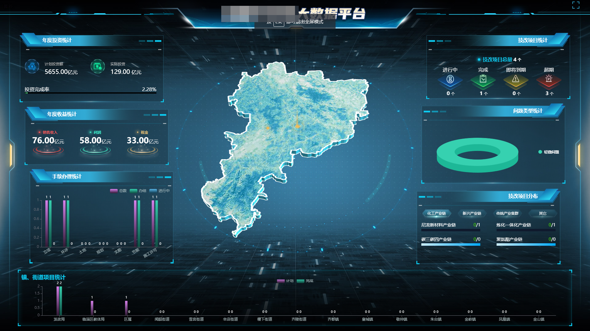

## 1. 模板生成工具类(template-generate)

```sh
cd template-generate
pnpm init
pnpm add -D readline
node  run.js
```

## 2. 打包上传服务器(package-upload)

```sh
cd template-generate
pnpm init
pnpm add -D chalk scp2 ssh2 compressing ora fs path
node  run.js
```

## 2. 下载文件，解压、压缩文件(download-zip)

```sh
cd template-generate
pnpm init
pnpm add -D http https compressing
```





```javascript
//复制文本
copyText(text) {
    var element = this.createElement(text);
    element.select();
    element.setSelectionRange(0, element.value.length);
    document.execCommand('copy');
    element.remove();
    this.$toast.success('已复制到剪切板');
},
//创建临时的输入框元素
createElement(text) {
    var isRTL = document.documentElement.getAttribute('dir') === 'rtl';
    var element = document.createElement('textarea');
    // 防止在ios中产生缩放效果
    element.style.fontSize = '12pt';
    // 重置盒模型
    element.style.border = '0';
    element.style.padding = '0';
    element.style.margin = '0';
    // 将元素移到屏幕外
    element.style.position = 'absolute';
    element.style[isRTL ? 'right' : 'left'] = '-9999px';
    // 移动元素到页面底部
    let yPosition = window.pageYOffset || document.documentElement.scrollTop;
    element.style.top = `${yPosition}px`;
    //设置元素只读
    element.setAttribute('readonly', '');
    element.value = text;
    document.body.appendChild(element);
    return element;
}
```
